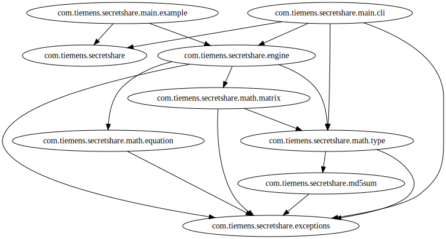

Architecture Documentation
==========================

The package dependencies in secretshare:

Some notes:
 1. com.tiemens.secretshare - looks odd as a dead-end.  This package only has BuildVersion.java, which seems like a natural place for this class.  It just makes the diagram look a bit strange.

Some To Do Items:
 1. com.tiemens.secretshare.math - would have been better if split into com.tiemens.secretshare.math.types and com.tiemens.secretshare.math.engine.  As it is, it looks like ".math.matrix" is a higher level than ".math".
 1. Logger - since java.util.Logger exists now, add logging to this library.

2018/Oct - fixed\
com.tiemens.secretshare.main.test - contains only "TicketTwoMain.java" (ticket two is a reference to the second GitHub issue).  The name ".main.test" is incorrect - it should be ".main.example"\
2018/Oct - fixed\
com.tiemens.secretshare.math.matrix - missing link to ".exceptions", reveals an implementation flaw in NumberMatrix.java.  There are "throw new ArithmeticException()" calls that should be "throw new SecretShareException()", as the Architecture Goals state.

Code
====
See [JDependTest.java](../src/test/java/com/tiemens/secretshare/JDependTest.java) for a very easy-to-configure test of package dependencies.

Command Line
====
java -cp $(find $HOME/.gradle/caches -name "jdepend-2.9.1.jar") jdepend.swingui.JDepend ./build/classes

Architecture Goals
==================
 1. Single "library" exception SecretShareException\
   This allows callers to easily isolate SecretShare errors.
   Especially useful for [N-version programming](https://en.wikipedia.org/wiki/N-version_programming) where SecretShare is one of the implementation choices, and the goal is to ignore SecretShare-specific exceptions (because there are N-1 other implementations), but not use "catch (Exception e)", since that is over-capturing potential system errors.
2.  No compile dependencies on 3rd-party libraries\
   Because 3rd-party libraries hinder use of a library, this library shall have no 3rd-party dependencies in order to run.
   Test dependencies are allowed (JUnit, JDepend)
3.  Logging\
   Because of "No compile dependencies", there is very little logging implemented in this library.
   Because this library pre-dates java.util.logging.Logger, it does not use this class.
   However, as an architectural goal, it should be refactored to use java.util.logging.Logger

